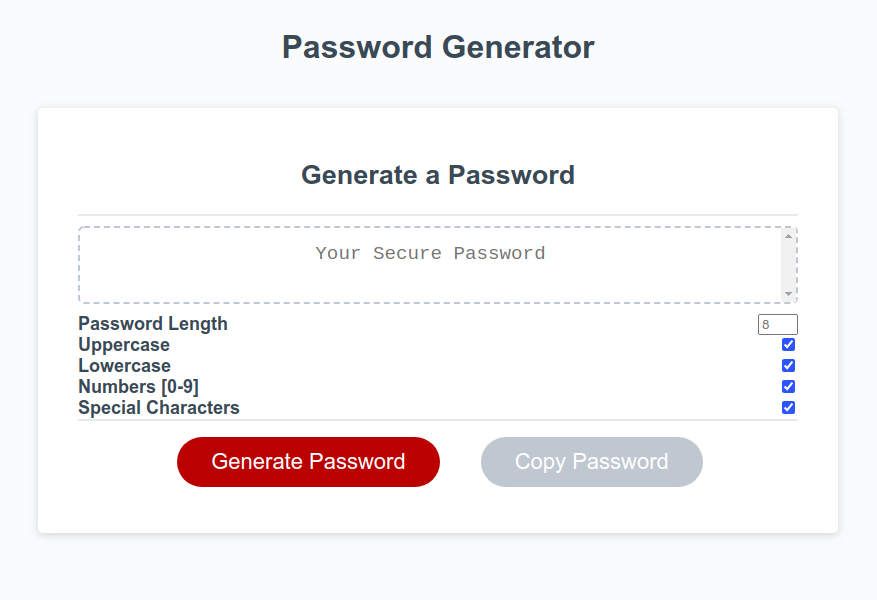
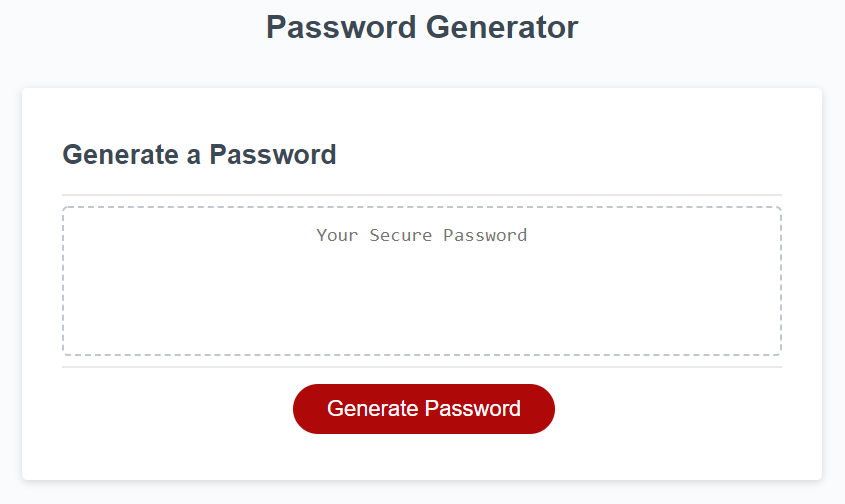

# 03 JavaScript: Password Generator

## What I Did...
I decided to take this password generator assignment quite a few steps further than the acceptance criteria. My reason for doing this was simple. ___Constantly being bombarded with JS alerts and prompts gets overly annoying!___

For this reason, I decided to alter the UI to suite a more real-world UX. Replacing prompts and alerts for user input with HTML Elements such as checkboxes and a number input field.

## How it works

The user can simply enter their desired password length, check a few boxes that will match the critera of their desired password and simply click the generate button to receive a generated password. It will be automatically displayed in the textarea element with the placeholder text of, "Your Secure Password".

## Features
- Enforced password minimum and miximum lengths
  - min: 8 characters
  If you do not input a length OR your length is less 8 characters, the program will automatically give you a default 8 characters in your generated password.
  - max: 128 characters
  If you decide try and go over 128 characters, this program will automatically spit out a maximum of 128 characters. You can manually put 300 characters and it will still give you 128 characters max.

- Enforced selection of at least one setting.
  - Will not a generate password without at least one setting being checked.
- Added another break point for XS screens (max-width: 320px)

## Todo List
 - [x] Support symbols
 - [x] Support numbers [0-9]
 - [x] Support uppercase characters
 - [x] Support lowercase characters
 - [x] Enforce minimum password length of 8
 - [x] Enforce maximum password length of 128
 - [x] Inform user when no settings are selected.
 - [x] Enforce selecting at lease one setting
 - [x] Support XS screen sizes (max-width: 320px)
 - [x] Purposefully give console warnings when user tries undesired actions.
 - [ ] **BONUS**: Copy to clipboard button

## Screenshot of finished project


---

### Your Task

This week’s homework requires you to create an application that an employee can use to generate a random password based on criteria they’ve selected by modifying starter code. This app will run in the browser, and will feature dynamically updated HTML and CSS powered by JavaScript code that you write. It will have a clean and polished user interface that is responsive, ensuring that it adapts to multiple screen sizes.

The password can include special characters. If you’re unfamiliar with these, see this [list of Password Special Characters from the OWASP Foundation](https://www.owasp.org/index.php/Password_special_characters).

### User Story

```
AS AN employee with access to sensitive data
I WANT to randomly generate a password that meets certain criteria
SO THAT I can create a strong password that provides greater security
```

### Acceptance Criteria

```
GIVEN I need a new, secure password
WHEN I click the button to generate a password
THEN I am presented with a series of prompts for password criteria
WHEN prompted for password criteria
THEN I select which criteria to include in the password
WHEN prompted for the length of the password
THEN I choose a length of at least 8 characters and no more than 128 characters
WHEN prompted for character types to include in the password
THEN I choose lowercase, uppercase, numeric, and/or special characters
WHEN I answer each prompt
THEN my input should be validated and at least one character type should be selected
WHEN all prompts are answered
THEN a password is generated that matches the selected criteria
WHEN the password is generated
THEN the password is either displayed in an alert or written to the page
```

### Mock-Up

The following image shows the web application's original appearance and functionality:

